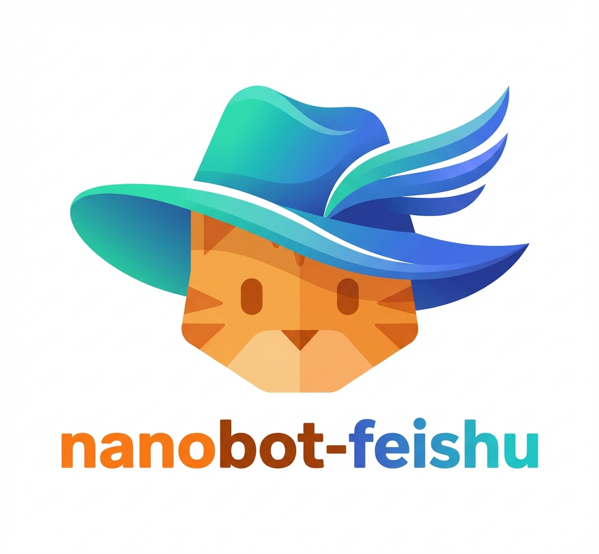

<div align="center">
  
</div>

# nanobot-feishu: Feishu AI Assistant

A Feishu-focused AI assistant based on [nanobot](https://github.com/HKUDS/nanobot), an ultra-lightweight personal AI assistant framework. This version extends nanobot with Feishu integration, advanced personal memory management, streaming card delivery, token budget visualization, knowledge-base retrieval, and built-in tools for PDF parsing, image generation, Notion database management, and more.

## 馃摙 News

- **2026-02-10**: First release of the Feishu-focused nanobot fork!
- **2026-02-24**: CLI mode with Feishu message send support.
- **2026-03-02**: Notion tool and Cloudinary integration for image hosting.
- **2026-03-08**: Switch Feishu delivery to interactive card markdown; simplify `message` tool into rich markdown + file modes.
- **2026-03-19**: Enhanced Notion tool with robust code fence parsing, nested list support, and LaTeX formula handling.
- **2026-03-21**: Session Context Compressor for automatic conversation history compression.
- **2026-03-23**: Feishu CardKit streaming mode with real-time token usage chart.
- **2026-03-24**: Tool call streaming support (real-time tool invocation push).
- **2026-03-31**: Advanced long-term personal memory system (SQLite store + LLM compiler + retriever + `memory_search` tool).

---

## 馃専 What's Changed

This fork introduces the following features and modifications on top of the original nanobot project:

### 1. 馃 Personal Memory System *(New)*

A full-featured personal long-term memory system backed by SQLite, enabling the agent to remember and recall facts, preferences, decisions, and project context across sessions.

| Component | Description |
|-----------|-------------|
| `PersonalMemoryStore` | SQLite-backed canonical store with BM25+priority+recency ranking |
| `MemoryCompiler` | LLM-assisted extraction, merging, and deduplication of memory candidates from conversations |
| `MemoryRetriever` | Builds retrieval queries from session context and injects relevant memories into prompts |
| `memory_search` tool | Allows the agent to actively query the memory database (supports filters by kind, scope, slot prefix) |

- **Memory kinds**: `preference`, `decision`, `reference`, `constraint`, `profile`
- **Scopes**: `global`, `topic`, `project` (with optional `scope_key`)
- **Auto-injection**: Retrieved memories are automatically appended to the system prompt each turn
- Configured via `tools.memory_system` in `config.json`

### 2. 馃搲 Session Context Compressor *(New)*

Automatically compresses long conversation histories into a rolling summary to manage token budgets and prevent context overflow.

- **Trigger conditions**: Message count threshold or estimated token count threshold (configurable)
- **Rolling summary**: Preserves key decisions and context while discarding verbose history
- **Keep recent**: Always retains the N most recent messages for continuity
- **Configurable model**: Can use a separate (cheaper) model for compression
- Configured via `tools.context_compression` in `config.json`

### 3. 馃摗 Feishu CardKit Streaming *(New)*

Real-time streaming message delivery via Feishu's CardKit API, replacing the previous "send once" pattern.

- **Streaming text**: Bot responses are streamed token-by-token to the user in real time
- **Token usage chart**: Embedded chart visualization showing input/output token consumption and budget residue
- **Tool call streaming**: When the agent invokes a tool, a real-time notification is pushed showing the tool name and parameters
- **Preemptive timeout handling**: Automatic fallback to regular messages before CardKit's hard timeout
- **Throttling**: Local rate limiting to stay within Feishu API limits
- Configured via `channels.feishu.streaming*` fields in `config.json`

### 4. 馃搫 Tool: `parse_pdf_mineru`

A document parsing tool powered by the [MinerU](https://mineru.net) v4 batch APIs. Converts PDFs to structured Markdown with images.

- Supports batch URL mode and batch local file upload mode
- Asynchronous polling with configurable timeout and interval
- Supports model version override (`pipeline` / `vlm` / `MinerU-HTML`)
- Downloads and extracts `full.md` and `images/` from result ZIP archives
- Configured via `tools.mineru` in `config.json`

### 5. 馃柤锔?Tool: `image_generate`

An image generation tool using OpenAI-compatible endpoints, with optional direct delivery to Feishu.

- **Text-to-image**: Generate images from a text prompt
- **Image editing**: Accept single or multiple input images for editing tasks
- **Aspect ratio control**: Supports `1:1`, `16:9`, `original`, etc.
- **Feishu integration**: Optionally upload and send the generated image to Feishu directly
- Configured via `tools.image_gen` in `config.json`

### 6. 馃棧锔?Tool: `session_manage`

Programmatic session management for maintaining multiple parallel conversation contexts.

- **`create`**: Create a new session with auto-generated or custom title
- **`switch`**: Switch to an existing session by key
- **`list`**: List all sessions with titles and timestamps
- **`current`**: Show the currently active session
- **`reset`**: Clear active session override

### 7. 馃摀 Tool: `notion`

Notion database management tool for ingesting and organizing documents.

- **`inspect_database`**: View database schema and recent entries
- **`upload_file`**: Upload local files (Markdown, PDF, etc.) as Notion pages with full rich-text rendering
- **`list_items`**: List database entries with filtering
- **`reclassify_item`**: Change document type classification
- **`ensure_partitions`**: Create type-based database partitions
- **Rich Markdown 鈫?Notion blocks**: Supports tables, code blocks (language-aware), nested lists, inline math (LaTeX), bold/italic/strikethrough, links, and images
- **Cloudinary integration**: Optional image hosting for Notion page images
- Configured via `tools.notion` in `config.json`

### 8. 馃攢 Tool: `spawn`

Spawn asynchronous subagents for complex or time-consuming background tasks.

- Subagents run independently and report results back to the main agent
- Supports custom labels for task identification
- Full tool access inherited from the parent agent

### 9. 馃攧 Enhanced Feishu Channel

The Feishu channel implementation has been significantly upgraded:

- **Interactive card messages**: Responses sent as Feishu `interactive` template cards with markdown content
- **Markdown local image auto-upload**: `` 鈫?auto-uploaded with Feishu `image_key`
- **Image receiving**: Incoming images are downloaded and saved to a configurable media directory
- **File sending**: Upload and send files (PDF, DOCX, XLSX, PPTX, etc.) as file messages (30MB limit)
- **Reaction feedback**: Automatic thumbs-up reaction on received messages as a "seen" indicator

### 10. 馃攳 Transparent Tool-Call Notifications

- Real-time notification pushed to user when the agent invokes a tool (tool name + parameters)
- Tool-call records written into session history for full trace
- Makes agent behavior fully transparent and debuggable

---

## 馃殌 Quick Start

### 1. Install

```bash
git clone https://github.com/<your-username>/<your-repo>.git
cd <your-repo>
pip install -e .
```

### 2. Initialize

```bash
nanobot onboard
```

### 3. Configure

By default nanobot stores data in `~/.nanobot`. To use a custom directory, set `NANOBOT_HOME`:

```bash
export NANOBOT_HOME=/path/to/your/.nanobot
```

Then edit `$NANOBOT_HOME/config.json`. See [Configuration Reference](#configuration-reference) below.

### 4. Set Up Feishu Bot

1. Visit [Feishu Open Platform](https://open.feishu.cn/app) 鈫?Create a new app 鈫?Enable **Bot** capability
2. **Permissions**: Add the following scopes:
   - `im:message` 鈥?Send messages
   - `im:message:send_as_bot` 鈥?Send as bot
   - `im:resource` 鈥?Download images
   - `im:message:readonly` 鈥?Receive messages
   - `im:message.p2p_msg:readonly` 鈥?Receive private messages
   - `docs:document.content:read` 鈥?Read cloud document content
   - `cardkit:card:write` 鈥?Create/update streaming cards
   - `contact:user.employee_id:readonly` 鈥?Identify users (multi-user scenarios)
3. **Events**: Subscribe to `im.message.receive_v1` 鈫?Select **Long Connection** (WebSocket) mode (no public IP required)
4. Get **App ID** and **App Secret** from "Credentials & Basic Info"
5. **Card Template**: Create a card template in Feishu Card Builder with a markdown content variable, note down the template ID
6. Publish the app

### 5. Run

Start the gateway (Feishu bot):

```bash
nanobot gateway
```

Or chat directly via CLI:

```bash
nanobot agent -m "Hello!"
```

Interactive CLI mode:

```bash
nanobot agent
```

---

## Configuration Reference

Config file: `$NANOBOT_HOME/config.json` (default: `~/.nanobot/config.json`)

### 馃攲 Providers

| Provider | Purpose | Get API Key |
|----------|---------|-------------|
| `openrouter` | LLM (recommended, access to all models) | [openrouter.ai](https://openrouter.ai) |
| `anthropic` | LLM (Claude direct) | [console.anthropic.com](https://console.anthropic.com) |
| `openai` | LLM (GPT / o-series direct) | [platform.openai.com](https://platform.openai.com) |
| `deepseek` | LLM (DeepSeek direct) | [platform.deepseek.com](https://platform.deepseek.com) |
| `gemini` | LLM (Gemini direct) | [aistudio.google.com](https://aistudio.google.com) |
| `groq` | LLM + Voice transcription (Whisper) | [console.groq.com](https://console.groq.com) |
| `zhipu` | LLM (GLM/ZhipuAI direct) | [open.bigmodel.cn](https://open.bigmodel.cn) |
| `moonshot` | LLM (Kimi/Moonshot direct) | [platform.moonshot.cn](https://platform.moonshot.cn) |
| `vllm` | LLM (self-hosted vLLM) | 鈥?|

### 馃洜锔?Tool-Specific Configuration

| Tool | Config Path | Required Keys | Description |
|------|------------|---------------|-------------|
| Web Search | `tools.web.search` | `apiKey` | [Serper](https://serper.dev) API key |
| MinerU PDF | `tools.mineru` | `token` | [MinerU](https://mineru.net) API token |
| Image Generation | `tools.image_gen` | `api_base`, `api_key`, `model_name` | OpenAI-compatible image API |
| Notion | `tools.notion` | `api_key`, `database_id` | [Notion Integration](https://www.notion.so/my-integrations) token |
| Memory System | `tools.memory_system` | 鈥?(all optional) | Personal memory database config |
| Context Compression | `tools.context_compression` | 鈥?(all optional) | Session compression settings |

### 馃摗 Feishu Channel

| Field | Description | Default |
|-------|-------------|---------|
| `appId` | App ID from Feishu Open Platform | 鈥?|
| `appSecret` | App Secret from Feishu Open Platform | 鈥?|
| `encryptKey` | Encrypt Key (optional for WebSocket mode) | `""` |
| `verificationToken` | Verification Token (optional for WebSocket mode) | `""` |
| `allowFrom` | Allowed user `open_id` list; empty = allow all | `[]` |
| `mediaDir` | Directory to save received media | `$NANOBOT_HOME/media` |
| `cardTemplateId` | Feishu card template ID for interactive messages | `"AAqK6dMNHUVKE"` |
| `cardTemplateVersionName` | Card template version | `"1.0.0"` |
| `streamingEnabled` | Enable CardKit streaming mode | `false` |
| `streamingPrintFrequencyMsDefault` | Client render frequency (ms) | `20` |
| `streamingPrintStepDefault` | Characters per render tick | `1` |
| `streamingPrintStrategy` | Streaming print policy (`fast` / `delay`) | `"delay"` |
| `streamingMaxUpdatesPerSec` | Local throttling for update requests | `50` |
| `streamingPreemptiveTimeoutSec` | Preemptive switch to regular messages before CardKit timeout | `480` |
| `streamingFinalizeTimeoutSec` | Reserved timeout for graceful finalize | `45` |

### 馃 Memory System

| Field | Description | Default |
|-------|-------------|---------|
| `enabled` | Enable personal memory system | `false` |
| `db_path` | SQLite database path | `$WORKSPACE/memory/personal_memory.db` |
| `default_user_id` | Default user ID for shared memories | `"shared"` |
| `retrieval_top_k` | Max memories to retrieve per turn | `5` |
| `core_memory_max_items` | Max items in auto core memory block | `8` |
| `max_candidates_per_run` | Max new candidates extracted per conversation turn | `3` |
| `llm_model` | Model for memory extraction (null = use default) | `null` |
| `update_memory_md` | Sync core memories to `MEMORY.md` | `true` |
| `retrieval_weights.*` | Fine-tune ranking weights (keyword, tag, summary, content, priority, recency, kind, scope) | see schema |

### 馃搲 Context Compression

| Field | Description | Default |
|-------|-------------|---------|
| `enabled` | Enable session context compression | `false` |
| `trigger_by_message_count` | Compress when message count exceeds this | `80` |
| `trigger_by_estimated_tokens` | Compress when estimated tokens exceed this | `12000` |
| `keep_recent_messages` | Always keep N most recent messages | `25` |
| `summary_max_tokens` | Max tokens for each compression summary | `800` |
| `max_rolling_summary_tokens` | Max accumulated rolling summary tokens | `2000` |
| `summary_model` | Model for compression (null = use default) | `null` |
| `min_interval_seconds` | Min interval between compression runs | `60` |

### 馃 Agent Defaults

| Field | Description | Default |
|-------|-------------|---------|
| `model` | Default LLM model | `"anthropic/claude-opus-4-5"` |
| `max_tokens` | Max output tokens per response | `8192` |
| `context_window_tokens` | Context window budget (null = unlimited) | `null` |
| `token_budget_mode` | Budget mode: `"output"` or `"context"` | `"output"` |
| `merge_subagent_usage` | Merge subagent token usage into parent | `true` |
| `temperature` | Sampling temperature | `0.7` |
| `reasoning_effort` | Reasoning effort hint (model-specific) | `null` |
| `max_tool_iterations` | Max tool call iterations per turn | `20` |

### 馃摠 Message Tool Usage

The `message` tool supports two message categories:

1. **Rich markdown content** 鈥?Use `content` to send plain text, image-only, or mixed text+image messages
   - Local images in markdown should use absolute paths: ``
   - Images are auto-uploaded and replaced with Feishu `image_key` at send time
2. **File messages** 鈥?Use `file_path` or `file_base64` to send files

<details>
<summary><b>Full config.json example</b></summary>

```json
{
  "agents": {
    "defaults": {
      "workspace": "$NANOBOT_HOME/workspace",
      "model": "openai/claude-sonnet-4-6-thinking",
      "maxTokens": 10240,
      "contextWindowTokens": null,
      "tokenBudgetMode": "output",
      "mergeSubagentUsage": true,
      "temperature": 0.7,
      "reasoningEffort": null,
      "maxToolIterations": 50
    }
  },
  "providers": {
    "openrouter": {
      "apiKey": "sk-or-v1-xxx"
    },
    "openai": {
      "apiKey": "sk-xxx",
      "apiBase": "https://your-proxy.com/v1/"
    }
  },
  "channels": {
    "feishu": {
      "enabled": true,
      "appId": "cli_xxx",
      "appSecret": "xxx",
      "encryptKey": "",
      "verificationToken": "",
      "allowFrom": [],
      "cardTemplateId": "AAqK6dMNHUVKE",
      "cardTemplateVersionName": "1.0.0",
      "streamingEnabled": true,
      "streamingPrintFrequencyMsDefault": 20,
      "streamingPrintStepDefault": 1,
      "streamingPrintStrategy": "delay",
      "streamingMaxUpdatesPerSec": 50,
      "streamingPreemptiveTimeoutSec": 480,
      "streamingFinalizeTimeoutSec": 45
    }
  },
  "tools": {
    "web": {
      "search": {
        "apiKey": "serper-api-key",
        "maxResults": 5
      }
    },
    "exec": {
      "timeout": 60
    },
    "mineru": {
      "api_url": "https://mineru.net/api/v4/extract/task",
      "token": "mineru-token",
      "model_version": "vlm",
      "timeout": 100,
      "poll_interval": 5
    },
    "image_gen": {
      "api_base": "https://your-api.com/v1",
      "api_key": "your-key",
      "model_name": "gemini-3-pro-image-preview",
      "timeout": 120,
      "retry_attempts": 3
    },
    "notion": {
      "enabled": true,
      "api_key": "secret_xxx",
      "database_id": "default-db-id",
      "type_database_map": {
        "notes": "db-id-for-notes",
        "reports": "db-id-for-reports"
      },
      "type_property": "Type",
      "cloudinary": {
        "cloud_name": "",
        "api_key": "",
        "api_secret": ""
      }
    },
    "tool_history": {
      "max_events": 5,
      "preview_chars": 160,
      "max_chars": 800
    },
    "context_compression": {
      "enabled": true,
      "trigger_by_message_count": 80,
      "trigger_by_estimated_tokens": 12000,
      "keep_recent_messages": 25,
      "summary_max_tokens": 800,
      "max_rolling_summary_tokens": 2000,
      "summary_model": null,
      "min_interval_seconds": 60
    },
    "memory_system": {
      "enabled": true,
      "db_path": "$NANOBOT_HOME/workspace/memory/personal_memory.db",
      "default_user_id": "shared",
      "retrieval_top_k": 5,
      "core_memory_max_items": 8,
      "max_candidates_per_run": 3,
      "llm_model": null,
      "update_memory_md": true,
      "retrieval_weights": {
        "keyword": 2.0,
        "tag": 1.5,
        "summary": 1.5,
        "content": 1.0,
        "priority": 0.15,
        "recency": 0.3,
        "kind": 0.5,
        "scope": 0.5
      }
    },
    "restrictToWorkspace": false
  }
}
```

</details>

---

## CLI Reference

| Command | Description |
|---------|-------------|
| `nanobot onboard` | Initialize config & workspace |
| `nanobot agent -m "..."` | Send a single message to the agent |
| `nanobot agent` | Interactive chat mode |
| `nanobot gateway` | Start the gateway (Feishu bot + cron service) |
| `nanobot status` | Show current status |
| `nanobot cron add` | Add a scheduled task |
| `nanobot cron list` | List scheduled tasks |
| `nanobot cron remove <id>` | Remove a scheduled task |

---

## 馃搧 Project Structure

```
nanobot/
鈹溾攢鈹€ agent/                       # Core agent logic
鈹?  鈹溾攢鈹€ loop.py                  #   Agent loop (LLM 鈫?tool execution + token monitor)
鈹?  鈹溾攢鈹€ context.py               #   Prompt & context builder
鈹?  鈹溾攢鈹€ memory.py                #   File-based persistent memory
鈹?  鈹溾攢鈹€ memory_compiler.py       #   鈽?LLM-assisted personal memory extraction & merging
鈹?  鈹溾攢鈹€ memory_retriever.py      #   鈽?Personal memory retrieval & prompt injection
鈹?  鈹溾攢鈹€ personal_memory_store.py #   鈽?SQLite-backed long-term memory store
鈹?  鈹溾攢鈹€ skills.py                #   Skills loader
鈹?  鈹溾攢鈹€ subagent.py              #   Background task execution
鈹?  鈹斺攢鈹€ tools/                   #   Built-in tools
鈹?      鈹溾攢鈹€ base.py              #     Tool base class
鈹?      鈹溾攢鈹€ registry.py          #     Dynamic tool registry
鈹?      鈹溾攢鈹€ filesystem.py        #     File read/write/edit/list/append
鈹?      鈹溾攢鈹€ shell.py             #     Shell command execution
鈹?      鈹溾攢鈹€ web.py               #     Web search & fetch
鈹?      鈹溾攢鈹€ message.py           #     Message sending (rich markdown + file)
鈹?      鈹溾攢鈹€ pdf_mineru.py        #     鈽?PDF parsing via MinerU API
鈹?      鈹溾攢鈹€ image_generate.py    #     鈽?Image generation & Feishu delivery
鈹?      鈹溾攢鈹€ session_manage.py    #     鈽?Session create/switch/reset
鈹?      鈹溾攢鈹€ notion.py            #     鈽?Notion database management
鈹?      鈹溾攢鈹€ memory_search.py     #     鈽?Personal memory search
鈹?      鈹溾攢鈹€ spawn.py             #     鈽?Subagent spawning
鈹?      鈹斺攢鈹€ cron.py              #     Cron task management
鈹溾攢鈹€ channels/                    # Chat channel integrations
鈹?  鈹溾攢鈹€ base.py                  #   Base channel interface
鈹?  鈹溾攢鈹€ manager.py               #   Channel manager
鈹?  鈹溾攢鈹€ feishu.py                #   鈽?Enhanced Feishu (CardKit streaming, token chart, images, files)
鈹?  鈹溾攢鈹€ telegram.py              #   Telegram
鈹?  鈹溾攢鈹€ discord.py               #   Discord
鈹?  鈹斺攢鈹€ whatsapp.py              #   WhatsApp
鈹溾攢鈹€ session/                     # Conversation session management
鈹?  鈹溾攢鈹€ manager.py               #   鈽?Session CRUD with active session tracking
鈹?  鈹斺攢鈹€ compressor.py            #   鈽?Session context compression
鈹溾攢鈹€ bus/                         # Message routing (event bus)
鈹溾攢鈹€ cron/                        # Scheduled task service
鈹溾攢鈹€ heartbeat/                   # Proactive wake-up service
鈹溾攢鈹€ providers/                   # LLM providers (LiteLLM-based)
鈹溾攢鈹€ config/                      # Configuration schema & loader (Pydantic)
鈹溾攢鈹€ skills/                      # Bundled skills (github, weather, tmux, cron, skill-creator, summarize)
鈹溾攢鈹€ cli/                         # CLI commands
鈹斺攢鈹€ utils/                       # Helpers
```

> Items marked with 鈽?are new or significantly modified in this fork.

---

## 馃檹 Acknowledgements

This project is based on [nanobot](https://github.com/HKUDS/nanobot) by [HKUDS](https://github.com/HKUDS). Licensed under [MIT](./LICENSE).
